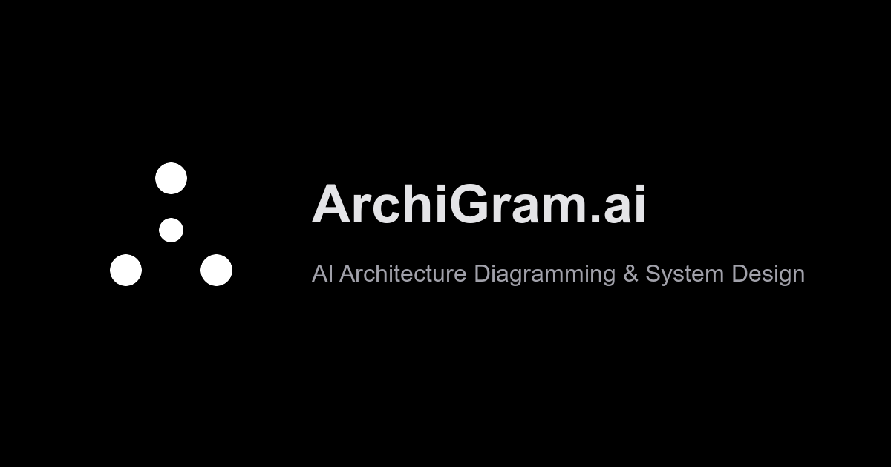

<div align="center">

# ArchiGram.ai

### Describe your architecture. AI draws it.

[](https://opensource.org/licenses/MIT)
[](https://www.typescriptlang.org/)
[](https://reactjs.org/)
[](https://deepmind.google/technologies/gemini/)
[](CONTRIBUTING.md)

[Live Demo](https://archigram-ai.vercel.app) · [Report Bug](https://github.com/isatimur/archigram.ai/issues) · [Request Feature](https://github.com/isatimur/archigram.ai/issues)



</div>

---

## What is ArchiGram.ai?

ArchiGram.ai is an **AI-powered architecture diagramming tool** that transforms natural language descriptions into production-ready diagrams. Stop dragging boxes — start describing systems.

```
Input:  "Create a microservices architecture with API gateway,
         user service, order service, Redis cache, and PostgreSQL"

Output: Complete Mermaid.js diagram in 2 seconds
```

## Features

### AI-Powered Generation
Describe your system in plain English. Gemini 3 Flash generates valid Mermaid.js code instantly.

### Vision AI
Scan whiteboard sketches, screenshots, or hand-drawn diagrams. AI converts them to editable code.

### Architectural Audit
AI analyzes your diagrams for:
- Single points of failure
- Security vulnerabilities
- Scalability bottlenecks
- Missing components

### Multiple Diagram Formats
- **Mermaid.js**: Flowcharts, sequence, class, state, ER, Gantt, and more
- **PlantUML**: Enterprise-standard UML diagrams
- **BPMN**: Business process modeling

### Community Gallery
Browse, like, fork, and share diagrams with the community.

### Export & Share
- Export as SVG or high-resolution PNG
- Share via compressed URLs
- Embed in documentation

## Quick Start

### Option 1: Use Hosted Version
Visit [archigram-ai.vercel.app](https://archigram-ai.vercel.app) — no installation required.

### Option 2: Run Locally

```bash
# Clone the repository
git clone https://github.com/isatimur/archigram.ai.git
cd archigram.ai

# Install dependencies
bun install

# Set up environment variables
echo "GEMINI_API_KEY=your_api_key_here" > .env

# Start development server
bun run dev
```

Open [http://localhost:3000](http://localhost:3000) in your browser.

### Option 3: Deploy Your Own

[](https://vercel.com/new/clone?repository-url=https://github.com/isatimur/archigram.ai&env=GEMINI_API_KEY)

## Tech Stack

| Technology | Purpose |
|------------|---------|
| React 19 | UI Framework |
| TypeScript | Type Safety |
| Vite | Build Tool |
| Tailwind CSS | Styling |
| Google Gemini | AI Generation |
| Mermaid.js | Diagram Rendering |
| Supabase | Community Database |
| Vercel | Hosting |

## Usage Examples

### System Design
```
"Design a real-time chat application with WebSocket server,
message queue, presence service, and MongoDB"
```

### Cloud Architecture
```
"AWS architecture with ALB, ECS Fargate, RDS Aurora,
ElastiCache, and S3 for static assets"
```

### ML Pipeline
```
"ML training pipeline with data ingestion, feature store,
model training on GPU, experiment tracking, and model registry"
```

### Microservices
```
"E-commerce microservices: API gateway, product catalog,
inventory, cart, checkout, payment processing, notifications"
```

## Roadmap

- [x] AI diagram generation
- [x] Vision AI (image to diagram)
- [x] Architectural audit
- [x] Community gallery
- [x] PlantUML support
- [x] BPMN editor
- [ ] User authentication
- [ ] Real-time collaboration
- [ ] VS Code extension
- [ ] GitHub integration
- [ ] Team workspaces
- [ ] API access

See the [open issues](https://github.com/isatimur/archigram.ai/issues) for a full list of proposed features.

## Contributing

We love contributions! See [CONTRIBUTING.md](CONTRIBUTING.md) for how to get started.

### Quick Contribution Guide

1. Fork the repository
2. Create your feature branch (`git checkout -b feature/amazing-feature`)
3. Commit your changes (`git commit -m 'Add amazing feature'`)
4. Push to the branch (`git push origin feature/amazing-feature`)
5. Open a Pull Request

## Community

- [GitHub Discussions](https://github.com/isatimur/archigram.ai/discussions) - Ask questions, share ideas
- [Twitter](https://twitter.com/isatimur) - Follow for updates

## License

Distributed under the MIT License. See [LICENSE](LICENSE) for more information.

## Acknowledgments

- [Mermaid.js](https://mermaid.js.org/) - The incredible diagramming library
- [Google Gemini](https://deepmind.google/technologies/gemini/) - AI that powers our generation
- [Supabase](https://supabase.com/) - Backend infrastructure
- [Vercel](https://vercel.com/) - Hosting platform

---

<div align="center">

**If ArchiGram.ai helps you, please give it a ⭐**

Made with ❤️ by [Timur Isachenko](https://github.com/isatimur)

</div>
